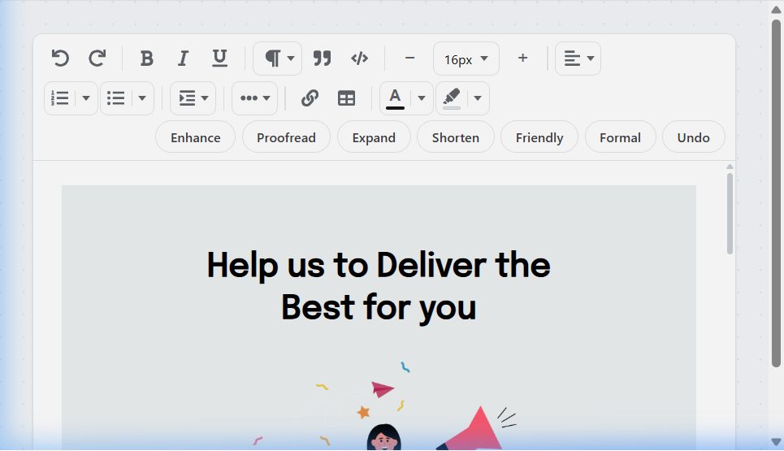

# FlowText Editor

[](https://www.npmjs.com/package/flowtext-editor)
[](https://github.com/gchandru136/FlowTextEditor/blob/main/LICENSE)

A modern, feature-rich React Rich Text Editor built for email templates, newsletters, and content editing.

---

## 🌐 Live Playground

Try the editor live in your browser:  
👉 **[https://flowtext-editor.vercel.app](https://flowtext-editor.vercel.app)**


---

## ✨ Features

* **✅ Rich Text Editing** — Clean contenteditable environment inside an isolated iframe to prevent style pollution.
* **✅ Heading & Paragraph Styles** — Easily switch between Headings (H1 to H6) and paragraph blocks.
* **✅ Font Size Controls** — Fluid font size selector with quick step controls.
* **✅ Text & Background Color** — Premium palette picker with custom Hex value input support.
* **✅ Bold / Italic / Underline** — Quick standard formatting shortcuts and visual active indicators.
* **✅ Numbered & Bulleted Lists** — Predefined list styles plus custom character bullet overrides.
* **✅ Text Alignment** — Left, Center, Right, and Justified alignments.
* **✅ Tables** — Drag-resizable cell margins, cell borders, and hover-triggered add row/column buttons.
* **✅ Links & Assets** — Popover anchor editor to insert, edit, follow, and remove links easily.
* **✅ Undo / Redo** — Complete editor action history.
* **✅ Spellcheck Support** — Built-in native browser spellcheck with user-provided exclude lists.
* **✅ Responsive Toolbar** — Automatic wrapping and row-edge spacing alignment.
* **✅ Light & Dark Theme** — Clean custom variables to theme the host shell and inner workspace.
* **✅ Modern UI** — Highly polished, split-button container layout inspired by Notion and Google Docs.

---

## 📦 Installation

Install the package via your preferred package manager:

```bash
# npm
npm install flowtext-editor

# yarn
yarn add flowtext-editor

# pnpm
pnpm add flowtext-editor
```

---

## 🚀 Quick Start

Here is a clean React example to get started:

```tsx
import React, { useState } from 'react';
import { FlowTextEditor } from 'flowtext-editor';
import 'flowtext-editor/styles.css';

export default function App() {
  const [content, setContent] = useState('<p>Start typing here...</p>');

  return (
    <div style={{ padding: '24px', maxWidth: '1000px', margin: '0 auto' }}>
      <h1>My Editor</h1>
      <FlowTextEditor
        mailContent={content}
        setMailContent={setContent}
        modalHeight="500px"
        spellcheckIgnoreWords={['FlowText']}
      />
    </div>
  );
}
```

> [!IMPORTANT]
> **Styles Opt-In:** Remember to import `flowtext-editor/styles.css` once in your application entry file to load design tokens and core dialog transitions correctly.

---

## ⚙️ Props

The `FlowTextEditor` component accepts the following props:

| Prop | Type | Default | Description |
| :--- | :--- | :--- | :--- |
| **`mailContent`** | `string` | — | **Required.** Controlled HTML value representing the editor content. |
| **`setMailContent`** | `(content: string) => void` | — | **Required.** Callback triggered on input change, returning the updated HTML. |
| **`resetMailContent`** | `boolean` | `false` | When set to `true`, forces the editor to overwrite its internal content with the current `mailContent` prop value. |
| **`modalHeight`** | `string` | `'650px'` | Height of the editor container (accepts any valid CSS unit like `px`, `vh`, `rem`). |
| **`spellcheckIgnoreWords`** | `string[]` | `[]` | List of custom words (like brand names or codes) that will be excluded from the native browser spellchecker. |

---

## 🚀 AI Features



AI-powered writing tools are currently under development and will be available in a future release. Stay tuned for exciting updates.

---

## 📄 License

This project is licensed under the MIT License — see the [LICENSE](./LICENSE) file for details.
